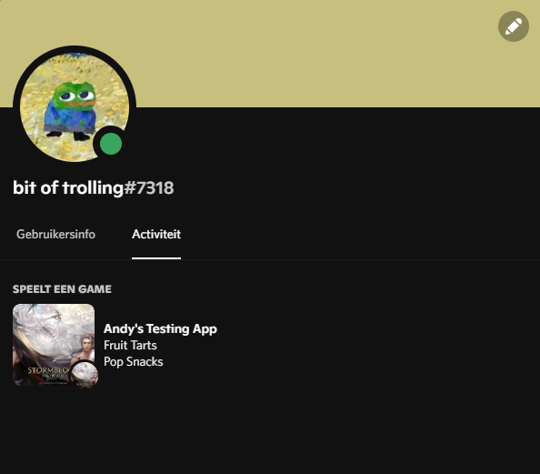

I# linc/DiscordSDK


Bindings for the Discord GameSDK

```actionscript
import sys.thread.Thread;
import discordsdk.DiscordSDK;

class Main {
	static final CLIENT_ID:String = "your_client_id_here";

	static function main() {
		DiscordSDK.init(CLIENT_ID, onInit, onError);
	}

	static function onInit() {
		DiscordSDK.updateActivity({
			assets: {
				largeImage: "icon"
			},
			type: Playing,
			timestamps: {
				start: Date.now().getTime()
			}
		});
		Thread.create(function() {
			while (true) {
				DiscordSDK.runCallbacks();
				Sys.sleep(0.4);
			}
		});
	}

	static function onError(result:Result) {
		trace("Error " + result);
	}
}
```

This is work in progress, expect things to change.

# Todo
* [] Make some functions really work
* [] Make discordsdk.DiscordSDK.Core.countUserAchievements
* [] Make discordsdk.DiscordSDK.Core.getCurrentLocale
* [] Make discordsdk.DiscordSDK.Core.getCurrentBranch
* [] Make discordsdk.DiscordSDK.Core.getOAuth2Token
* [] Make discordsdk.DiscordSDK.Core.fetch
* [] Make lobby manager
* [] Make relationship manager
* [] Make remaining stuff
